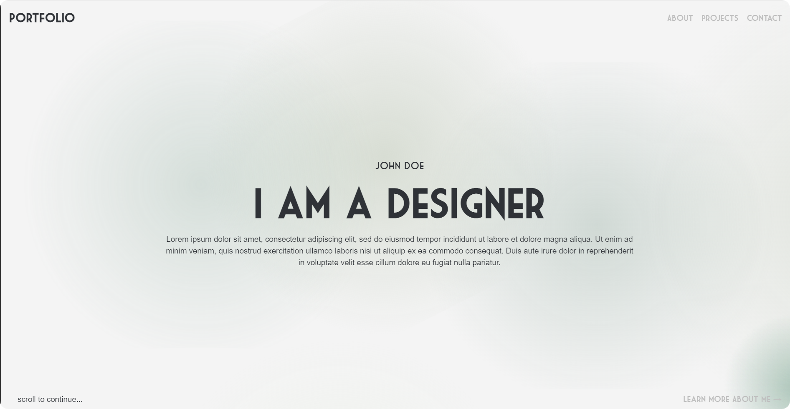
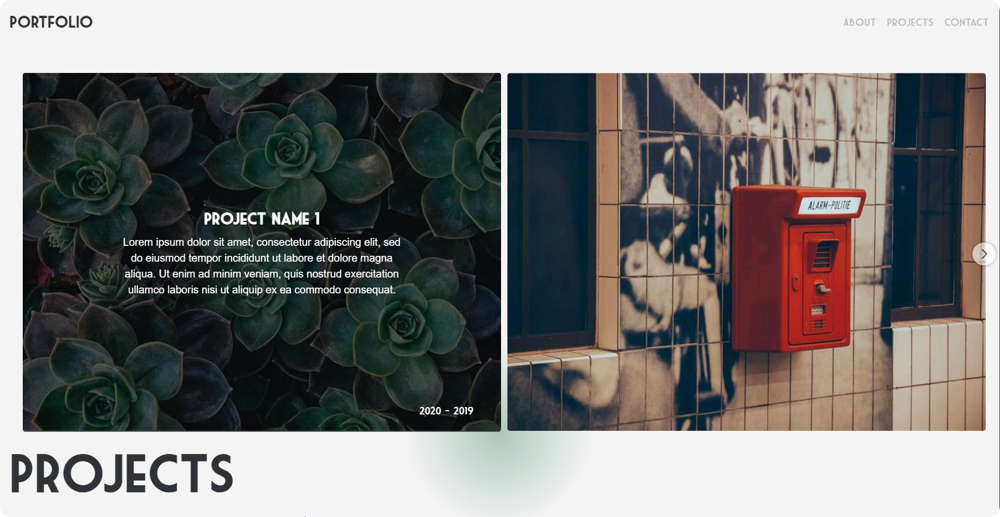
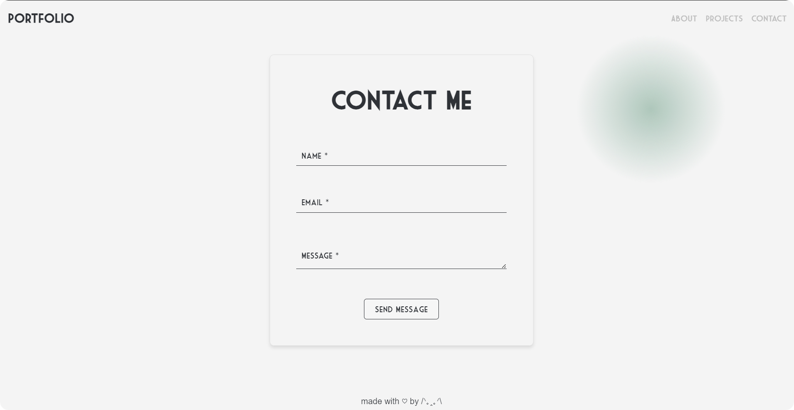

# Portfolio Website

This is a customizable portfolio website built with React. It allows you to display your projects, skills, and contact information in a professional format. 
The design is responsive and includes smooth animations, this template is perfect for developers, designers, or anyone looking to establish an online presence.

## Screenshots
### Home Page


### Projects Page


### Contact Page



## Table of Contents

- [Project Structure](#project-structure)
- [Setup and Installation](#setup-and-installation)
- [Customizing Your Portfolio](#customizing-your-portfolio)
- [Deployment](#deployment)
- [License](#license)
- [Important Notes](#important-notes)
- [Contact](#contact)

## Project Structure

The project is divided into several main directories:

```bash
    portfolio-website/
    │
    ├── public/                     # Static files like the main HTML, icons, and images
    │   └── index.html              # The root HTML file where React will mount the app
    │
    ├── src/                        # Source code for the React application
    │   ├── fonts/                  # Font files used in the application
    │   ├── components/             # Reusable React components
    │   ├── App.js                  # Main React component, often used for routing logic
    │   ├── index.js                # Entry point for React (where the app is rendered to the DOM)
    │   ├── index.css               # Main CSS file for global styles
    │   └── styles/                 # Custom styles for the application
    │
    ├── .gitignore                  # List of files and directories that Git should ignore
    ├── package.json                # Lists project dependencies, scripts, and metadata
    ├── package-lock.json           # Automatically generated, locks the dependency versions
    └── README.md                   # Documentation for the project
```

## Setup and Installation

### Prerequisites:
- Make sure you have [Node.js](https://nodejs.org/) installed on your machine.

### Steps:

1. **Download the ZIP File:**
If you purchased the code, download the project ZIP file from the provided link or from your purchase confirmation.

2. **Extract the ZIP File:**
Extract the contents of the ZIP file to your desired directory on your computer.

3. **Install Dependencies:**
After extracting the files, navigate to the project folder in your terminal:
```bash
    cd path/to/extracted-folder
```

Then, install the necessary dependencies by running:
```bash
    npm install --legacy-peer-deps
```

4. **Start the Development Server:**
Once the dependencies are installed, start the development server with:
```bash
    npm start
```
The website should now be running locally at `http://localhost:3000`.

## Customizing Your Portfolio
- Once the development server is running, you can begin modifying the website to suit your personal branding.
- All major sections of the site (e.g., About, Projects, Contact) can be customized in the `src/components` directory.
- If you want to modify the colors or the fonts, the root variables are defined in the `src/index.css` file.

## Deployment

### Local Deployment:
To build the project for production and serve it locally:
```bash
    npm run build
```
This will create a `build` folder with optimized production-ready files.

### Hosting:
You can deploy this project to any hosting provider. The built website works well with:

- GitHub Pages
- Netlify
- Vercel

## License
This project is sold as-is. Full ownership of the code is transferred to the buyer upon purchase. If you wish to use or modify this project for commercial purposes, you are free to do so.

## Important Notes
This project is sold as a commercial product, and I retain no rights after the sale. The code and design can be used, modified, and redistributed by the buyer. Please do not distribute the original source code outside of the purchase terms.

## Contact
If you have any questions or encounter any issues while installing the project, feel free to contact me:

- **Email:** [kiimissi.imane@gmail.com](mailto:kiimissi.imane@gmail.com)
- **Website:** [www.imanekimissi.website](https://www.imanekimissi.website)
- **LinkedIn:** [Kimissi Imane](https://www.linkedin.com/in/kimissi-imane-7b1aa624a/)


Thank you for purchasing this project! I hope it helps you create something amazing. 
If you enjoy working with it, don't hesitate to reach out with feedback or suggestions.
